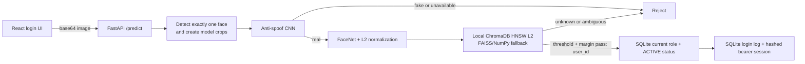

# V-Shield Codebase Summary

## Snapshot

- Review date: 2026-09-10.
- Project: face authentication with presentation attack detection (PAD).
- Architecture: React/Vite client, FastAPI backend, TensorFlow/Keras models, local persistent Chroma identity search with FAISS/NumPy fallback, SQLite role/login audit.
- Current evidence status: application and evaluation tooling exist; trustworthy PAD and identity-retrieval benchmark results are not yet available.

## System Goal

V-Shield's login UI captures a webcam frame, rejects invalid or spoof presentations, embeds a valid face with FaceNet, searches enrolled identities, obtains the matched user's role, and records a successful login. The HTTP API still receives a client-supplied base64 frame, so passive PAD remains the security boundary against static-image replay. It is a small-scale reference system, not a production biometric identity platform.

## Runtime Architecture



The anti-spoof stage is fail-closed: FaceNet and identity search run only after a real presentation result. When PAD is available, startup validates the explicitly consented authorization gallery under `data/authorization/chroma/`. A managed index checks SQLite gallery revision before matching and refreshes validated snapshots without retraining or restarting for HTTP changes. Chroma collections are revision-specific, with `user_id` metadata rather than authoritative roles; FAISS/NumPy can provide validated fallback. SQLite controls current account status and three roles: `SUPER_ADMIN`, `ADMIN`, `USER`.

## Main Components

| Concern | Current implementation |
|---|---|
| HTTP transport | `src/vshield/api/app.py` |
| Request schema | `src/vshield/api/schemas.py` |
| Roles and login audit | `src/vshield/api/database.py`, SQLite |
| Revocable bearer sessions and RBAC | `src/vshield/api/sessions.py` |
| Three-role schema and migration | `src/vshield/api/roles.py`, `migrations.py`, `bootstrap.py` |
| Scoped user administration | `src/vshield/api/user_routes.py`, `user_schemas.py`, `user_store.py` |
| HTTP face enrollment | `src/vshield/services/user_management.py`, `enrollment_images.py` |
| Revision-aware identity lookup | `src/vshield/core/managed_identity_index.py` |
| Authentication orchestration | `src/vshield/services/authentication.py` |
| Face preprocessing | `src/vshield/core/face_preprocessor.py` |
| PAD inference | `src/vshield/core/anti_spoof.py` |
| FaceNet embedding | `src/vshield/core/embedder.py` |
| Authorized enrollment loading | `src/vshield/core/authorization_gallery.py` |
| Trusted local enrollment | `src/vshield/services/enrollment.py`, `scripts/manage-identities.py` |
| Identity search | `src/vshield/core/identity_index.py` |
| Persistent vector store | `src/vshield/core/chroma_identity_index.py`, ChromaDB local |
| Production-coupled biometric evaluation | `src/vshield/evaluation/adapter.py`, `pad_runner.py`, `recognition_runner.py`, `e2e_runner.py` |
| Evaluation manifests, leakage audit, calibration, metrics, plots, reports | `src/vshield/evaluation/`, `scripts/evaluate_*.py`, `scripts/calibrate_*.py` |
| PAD training | `src/vshield/training/train.py` |
| Browser client | `frontend/src/` |

## Authentication Flow

1. React captures a webcam frame; the login page does not expose static-image upload.
2. The client sends a base64 data URI to `POST /predict`.
3. FastAPI validates encoded size, decoded pixel count, and image format.
4. The preprocessor requires exactly one face and produces model-specific crops.
5. The PAD CNN classifies the presentation. Fake, invalid, or unavailable states fail closed.
6. FaceNet produces a 512-dimensional embedding; code validates and L2-normalizes it.
7. ChromaDB queries the nearest stored FaceNet templates using L2 distance, then the identity index applies the existing distance threshold and runner-up margin. FAISS/NumPy is the startup fallback.
8. The match supplies a stable numeric `user_id`; SQLite checks that account is ACTIVE, records the login, and issues an opaque bearer session with a one-hour lifetime. Only its hash is stored.
9. Protected API requests resolve the current account and role from SQLite. ADMIN/SUPER_ADMIN log endpoints reject USER; logout, role changes, disabling and soft deletion revoke applicable sessions. Disabled accounts cannot obtain a session even if the matcher returns their ID.

## Identity Gallery Versus SQLite

Two stores have different responsibilities:

- `data/authorization/faces/<username>/`: explicit consented enrollment with canonical PNGs and an `enrollment.json` manifest binding checksums, 512D L2-normalized embeddings, and enrollment ID to an account.
- `data/authorization/chroma/`: ignored local persistent store containing FaceNet embeddings and identity metadata, not face images or authoritative roles.
- `login_logs.db`: existing relational account database, additively migrated with name/email, nullable unused password_hash, status, timestamps/creator; includes role/status constraints, unique email, schema version, gallery revision and management audit. No password login or duplicate SQL embedding column is introduced. Migration normalizes legacy roles and revokes old sessions once, never auto-promotes an ADMIN.
- `data/faces/`: legacy data, no longer automatically used for login authorization. Existing 54 unlabelled photos have not been assigned identities or roles.

Precision@5 and Recall@5 evaluate retrieval from the enrollment gallery. They do not evaluate SQLite queries or login-log filtering. No real user has been enrolled in the new private gallery and its initialized vector collection is empty, so repository-level retrieval values remain `N/A`. Public dataset faces never create authorized accounts automatically.

## Identity Retrieval Metrics

`IdentityIndex.ranked_identities()` ranks unique identities without applying the authentication threshold or margin. Multiple templates for one person collapse to that identity's minimum normalized L2 distance.

For probe `q`, one relevant identity `G(q)`, and the first five unique retrieved identities `R5(q)`:

```text
Precision@5(q) = |R5(q) ∩ G(q)| / 5
Recall@5(q)    = |R5(q) ∩ G(q)| / |G(q)|
```

Results are macro-averaged by probe. With one ground-truth identity per probe, Recall@5 equals Hit Rate@5 and Precision@5 has a maximum of `0.2`. This is retrieval precision, distinct from binary precision/recall used for PAD classification.

Real evaluation requires a versioned gallery/probe protocol with different samples, leakage controls, identity labels, sample/group IDs, and sufficient enrolled identities. Synthetic unit tests validate formulas and code paths only; they are not model-performance evidence. Open-set unknown probes require FPIR/FNIR rather than being forced into closed-set Precision@5/Recall@5.

## PAD Data and Evidence Status

Historical dataset v1 is invalid for model selection or performance claims:

- 2,415 historical samples are quarantined.
- 264 exact-duplicate groups cross splits, covering 746 image references.
- The historical audit found 1,567 cross-split dHash near-duplicate pairs at Hamming distance at most four.
- A newer conservative OpenCV dHash scan produced 5,998 cross-split candidates pending review; these are not 5,998 confirmed duplicates.
- A metadata-only classifier reached 99.59% accuracy and ROC-AUC 1.0, demonstrating severe shortcut/confound leakage rather than trustworthy PAD ability.
- Dataset v2 currently has zero released samples because required provenance and release gates are incomplete.

An external dataset import workflow now supports explicit source metadata and group-safe train/validation/test preparation; see `docs/external-datasets.md`. No new public dataset image samples were downloaded successfully in this implementation session. Import tooling is not evidence of a released dataset, and synthetic importer tests do not establish PAD performance.

Therefore v1 must not support accuracy, precision, recall, FAR, FRR, EER, APCER, BPCER, or deployment-readiness claims. PAD retraining and a locked v2 test remain blocked until a valid release exists.

## API and UI

Backend endpoints:

- `POST /predict`: face authentication.
- `GET /auth/me`: resolve a valid bearer session and its current role.
- `POST /auth/logout`: revoke the current session.
- `GET /logs`, `GET /logs/export`: ADMIN/SUPER_ADMIN log filtering and CSV export.
- `GET /users`: ADMIN sees USER accounts; SUPER_ADMIN sees all accounts.
- `POST /users`: ADMIN/SUPER_ADMIN enroll USER; `POST /admins`: only SUPER_ADMIN enrolls ADMIN.
- `PATCH /users/{id}`: profile; `/status`: ACTIVE/DISABLED; `DELETE /users/{id}`: soft delete. ADMIN manages only USER, SUPER_ADMIN manages USER/ADMIN.
- `PATCH /users/{id}/role`: only SUPER_ADMIN can change USER ↔ ADMIN. SUPER_ADMIN targets are protected from all HTTP mutations.

Frontend routes include login, admin dashboard, and user dashboard. The admin screen filters/exports logs and manages accounts with profile edits, disable/enable, soft delete and multi-image face enrollment. Only SUPER_ADMIN sees ADMIN creation and role changes. The client stores the bearer token in `sessionStorage` and checks `/auth/me`; browser role state cannot grant server access. Backend guards also recheck actor and target scope transactionally. Input forbids mass-assigned role/ID/embedding fields. API responses use `Cache-Control: no-store`; CORS defaults to local Vite origins, configurable through `VSHIELD_CORS_ORIGINS`.

## Technology Stack

- Python 3.10+, `uv`, src-layout packaging.
- TensorFlow/Keras, keras-facenet, ChromaDB local, FAISS CPU.
- OpenCV, MediaPipe, Pillow, NumPy, SciPy, scikit-learn.
- FastAPI, Uvicorn, Pydantic.
- React, Vite, React Router.
- SQLite.
- Pytest and Ruff.

## Current Limitations

- The checksum-pinned MiniFASNetV2 ONNX artifact is present and passes its contract smoke test. Real biometric performance remains unvalidated because no released PAD or independent recognition/e2e evaluation dataset exists.
- Enrollment supports authenticated management HTTP/UI with 2–10 consented images and a trusted local CLI (1–20 photos). The first SUPER_ADMIN requires explicit one-time local bootstrap. No API creates or mutates SUPER_ADMIN. CLI sync remains an offline stop/restart workflow; HTTP changes refresh the revision-aware index without restart. No complete biometric erasure or owner-transfer workflow exists.
- Duplicate face and same-identity gates use an uncalibrated L2 threshold (0.9), not demonstrated biometric accuracy. Enrollment is operator-supervised, not an independent identity/liveness proof. An account committed before index refresh failure returns `vector_sync_status=pending`, avoiding false failure/retry; matching retries refresh.
- Soft deletion retains account, photos, manifests, audit and old revision collections; it excludes the identity from the current snapshot and revokes sessions, not physical biometric erasure.
- Chroma and enrollment manifests store biometric embeddings locally without application-level encryption or a retention policy. `.gitignore` only prevents accidental Git commits; file ACLs, HTTPS, backup protection, and retention still need operational configuration.
- Authentication requests all locally stored templates so the runner-up margin is not based on a partial ANN result. This favors decision correctness over scalability and still requires measured Chroma-versus-exact parity.
- No valid released PAD v2 dataset or locked benchmark.
- No versioned recognition gallery/probe protocol or real Precision@5/Recall@5 result.
- Exact `IndexFlatL2` scales linearly with template count.
- Consent is explicitly confirmed during CLI/HTTP enrollment and checked in gallery manifests, but this is not an independent identity-verification or production consent-governance process.
- Backend RBAC is implemented; broader production protections such as rate limiting and a biometric retention/deletion policy remain outside this implementation.

## Evidence Map

- Project overview and runbook: `README.md`.
- Current account enrollment/RBAC runbook: `docs/face-authorization.md`.
- External dataset intake runbook: `docs/external-datasets.md`.
- Dependencies: `pyproject.toml`.
- Runtime code: `src/vshield/api/`, `src/vshield/core/`, `src/vshield/services/`.
- Evaluation code: `src/vshield/evaluation/`; source-referenced production audit: `docs/evaluation/VSHIELD_EVALUATION_AUDIT.md`; collection protocol: `evaluation_data/README.md`.
- Frontend: `frontend/src/`.
- v1 invalidation: `artifacts/evaluation/v1/INVALID.md`.
- v2 status: `artifacts/evaluation/v2/data-card.md` and `data-release-audit.json`.

## Unresolved Questions

- A recognition gallery/probe collection protocol must be approved before reporting real top-k metrics.
