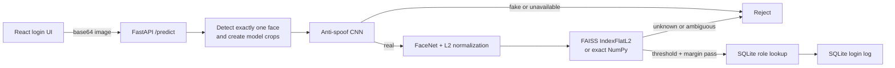

# V-Shield Codebase Summary

## Snapshot

- Review date: 2026-08-11.
- Project: face authentication with presentation attack detection (PAD).
- Architecture: React/Vite client, FastAPI backend, TensorFlow/Keras models, FAISS or NumPy identity search, SQLite role/login audit.
- Current evidence status: application and evaluation tooling exist; trustworthy PAD and identity-retrieval benchmark results are not yet available.

## System Goal

V-Shield accepts a webcam capture or uploaded image, rejects invalid or spoof presentations, embeds a valid face with FaceNet, searches enrolled identities, obtains the matched user's role, and records a successful login. It is a small-scale capstone system, not a production biometric identity platform.

## Runtime Architecture



The anti-spoof stage is fail-closed: FaceNet and identity search run only after a real presentation result. The identity index is an immutable startup snapshot of `data/faces/<username>/*`; changing enrollment images requires a backend restart.

## Main Components

| Concern | Current implementation |
|---|---|
| HTTP transport | `src/vshield/api/app.py` |
| Request schema | `src/vshield/api/schemas.py` |
| Roles and login audit | `src/vshield/api/database.py`, SQLite |
| Authentication orchestration | `src/vshield/services/authentication.py` |
| Face preprocessing | `src/vshield/core/face_preprocessor.py` |
| PAD inference | `src/vshield/core/anti_spoof.py` |
| FaceNet embedding | `src/vshield/core/embedder.py` |
| Enrollment loading | `src/vshield/core/verifier.py` |
| Identity search | `src/vshield/core/identity_index.py` |
| PAD evaluation | `src/vshield/evaluation/pad_metrics.py` |
| Identity retrieval evaluation | `src/vshield/evaluation/recognition_metrics.py` |
| PAD training | `src/vshield/training/train.py` |
| Browser client | `frontend/src/` |

## Authentication Flow

1. React captures a webcam frame or reads an uploaded image.
2. The client sends a base64 data URI to `POST /predict`.
3. FastAPI validates encoded size, decoded pixel count, and image format.
4. The preprocessor requires exactly one face and produces model-specific crops.
5. The PAD CNN classifies the presentation. Fake, invalid, or unavailable states fail closed.
6. FaceNet produces a 512-dimensional embedding; code validates and L2-normalizes it.
7. `IdentityIndex.search()` finds the nearest identity using L2 distance, then applies a distance threshold and runner-up margin.
8. A successful identity is mapped to a role and written to the SQLite login log.

## Identity Gallery Versus SQLite

Two stores have different responsibilities:

- `data/faces/<username>/*`: biometric enrollment gallery used to build embeddings and the FAISS/NumPy index.
- `login_logs.db`: relational data for username roles and successful login events.

Precision@5 and Recall@5 evaluate retrieval from the enrollment gallery. They do not evaluate SQLite queries or login-log filtering. At the review snapshot, `data/faces/` contains no username subdirectories, so repository-level retrieval values must remain `N/A`.

## Identity Retrieval Metrics

`IdentityIndex.ranked_identities()` ranks unique identities without applying the authentication threshold or margin. Multiple templates for one person collapse to that identity's minimum normalized L2 distance.

For probe `q`, one relevant identity `G(q)`, and the first five unique retrieved identities `R5(q)`:

```text
Precision@5(q) = |R5(q) ∩ G(q)| / 5
Recall@5(q)    = |R5(q) ∩ G(q)| / |G(q)|
```

Results are macro-averaged by probe. With one ground-truth identity per probe, Recall@5 equals Hit Rate@5 and Precision@5 has a maximum of `0.2`. This is retrieval precision, distinct from binary precision/recall used for PAD classification.

Real evaluation requires a versioned gallery/probe protocol with different samples, leakage controls, identity labels, sample/group IDs, and sufficient enrolled identities. Synthetic unit tests validate formulas and code paths only; they are not model-performance evidence. Open-set unknown probes require FPIR/FNIR rather than being forced into closed-set Precision@5/Recall@5.

## PAD Data and Evidence Status

Historical dataset v1 is invalid for model selection or performance claims:

- 2,415 historical samples are quarantined.
- 264 exact-duplicate groups cross splits, covering 746 image references.
- The historical audit found 1,567 cross-split dHash near-duplicate pairs at Hamming distance at most four.
- A newer conservative OpenCV dHash scan produced 5,998 cross-split candidates pending review; these are not 5,998 confirmed duplicates.
- A metadata-only classifier reached 99.59% accuracy and ROC-AUC 1.0, demonstrating severe shortcut/confound leakage rather than trustworthy PAD ability.
- Dataset v2 currently has zero released samples because required provenance and release gates are incomplete.

Therefore v1 must not support accuracy, precision, recall, FAR, FRR, EER, APCER, BPCER, or deployment-readiness claims. PAD retraining and a locked v2 test remain blocked until a valid release exists.

## API and UI

Backend endpoints:

- `POST /predict`: face authentication.
- `GET /logs`: filter login logs by username/date.
- `GET /logs/export`: export filtered logs as CSV.

Frontend routes include login, admin dashboard, and user dashboard. The admin screen filters/exports logs. Current role state is stored in browser `localStorage`; the log endpoints lack server-side authentication. These are known security limitations, not production-ready authorization.

## Technology Stack

- Python 3.10+, `uv`, src-layout packaging.
- TensorFlow/Keras, keras-facenet, FAISS CPU.
- OpenCV, MediaPipe, Pillow, NumPy, SciPy, scikit-learn.
- FastAPI, Uvicorn, Pydantic.
- React, Vite, React Router.
- SQLite.
- Pytest and Ruff.

## Current Limitations

- The anti-spoof model artifact is not tracked in Git; missing or invalid model state makes authentication unavailable.
- No enrollment API; enrollment is filesystem-based and requires restart.
- No valid released PAD v2 dataset or locked benchmark.
- No versioned recognition gallery/probe protocol or real Precision@5/Recall@5 result.
- Exact `IndexFlatL2` scales linearly with template count.
- CORS is permissive, admin protection is client-side, and log endpoints are unauthenticated.
- Biometric retention, consent, deletion, encryption, and access-control policies are not implemented as a production governance layer.

## Evidence Map

- Project overview and runbook: `README.md`.
- Dependencies: `pyproject.toml`.
- Runtime code: `src/vshield/api/`, `src/vshield/core/`, `src/vshield/services/`.
- Evaluation code: `src/vshield/evaluation/`.
- Frontend: `frontend/src/`.
- AI/ML audit: `plans/vshield-ai-ml-audit-2026-07-30.md`.
- Remediation status: `plans/vshield-data-integrity-remediation/`.
- v1 invalidation: `artifacts/evaluation/v1/INVALID.md`.
- v2 status: `artifacts/evaluation/v2/data-card.md` and `data-release-audit.json`.

## Unresolved Questions

- University capstone template, citation style, page limit, and required chapter structure have not been supplied.
- A recognition gallery/probe collection protocol must be approved before reporting real top-k metrics.
